# 第七周作业

## 周三必做题题2
按自己设计的表结构，插入 100 万订单模拟数据，测试不同方式的插入效率 /weeko7project/dbinsert1000k项目下

* 第一种方式：直接一条条插入，耗时约729s（zhangc.dbinsert100k.DataBaseInsert1）
  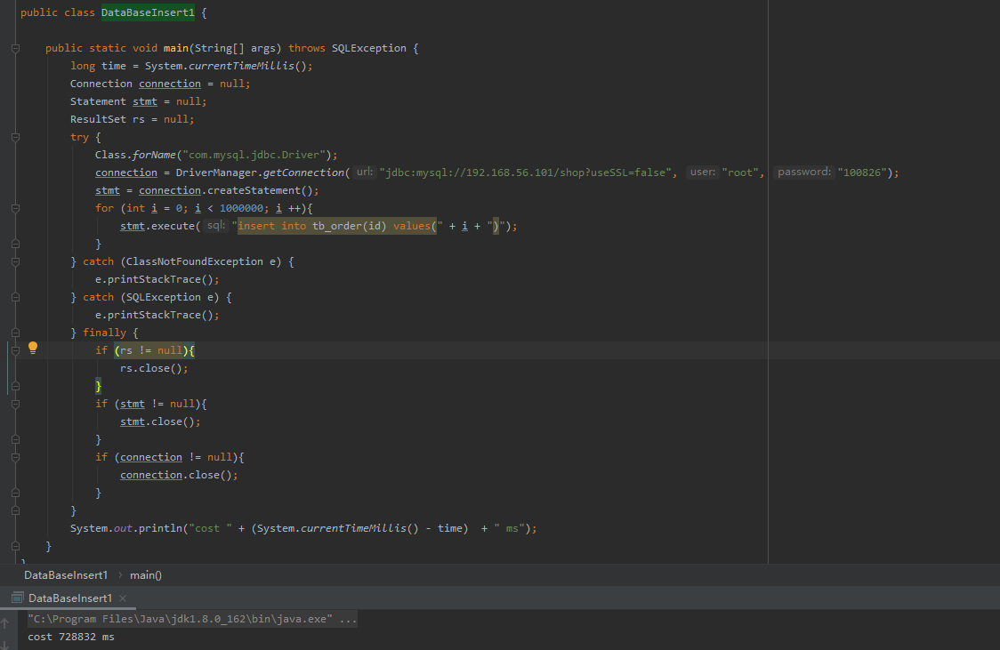
* 第二种方式：将多条数据拼接成一条sql，一次插入多条数据（zhangc.dbinsert100k.DataBaseInsert2），经测试在只有一个字段的情况下，每次5000-20000条性能最佳
  * 500条数据拼接成一条sql，分2000次插入,耗时约7s
    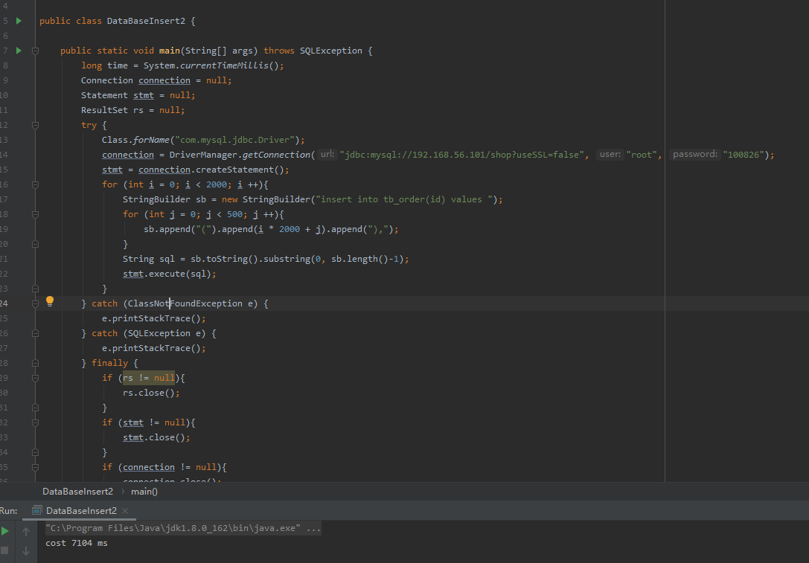
  * 1000条数据拼接成一条sql，分1000次插入,耗时约5s
    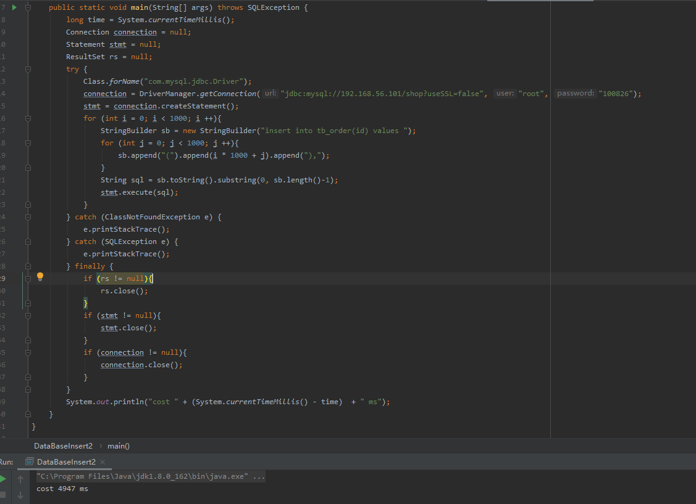
  * 5000条数据拼接成一条sql，分200次插入,耗时约4s
    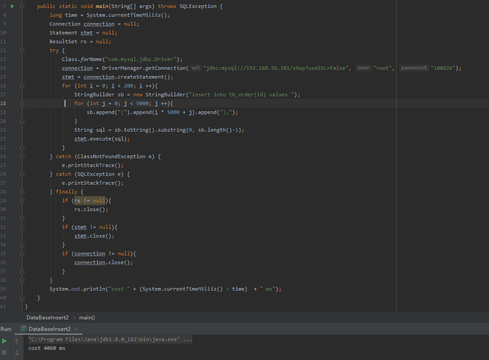
  * 20000条数据拼接成一条sql，分50次插入,耗时约4s
    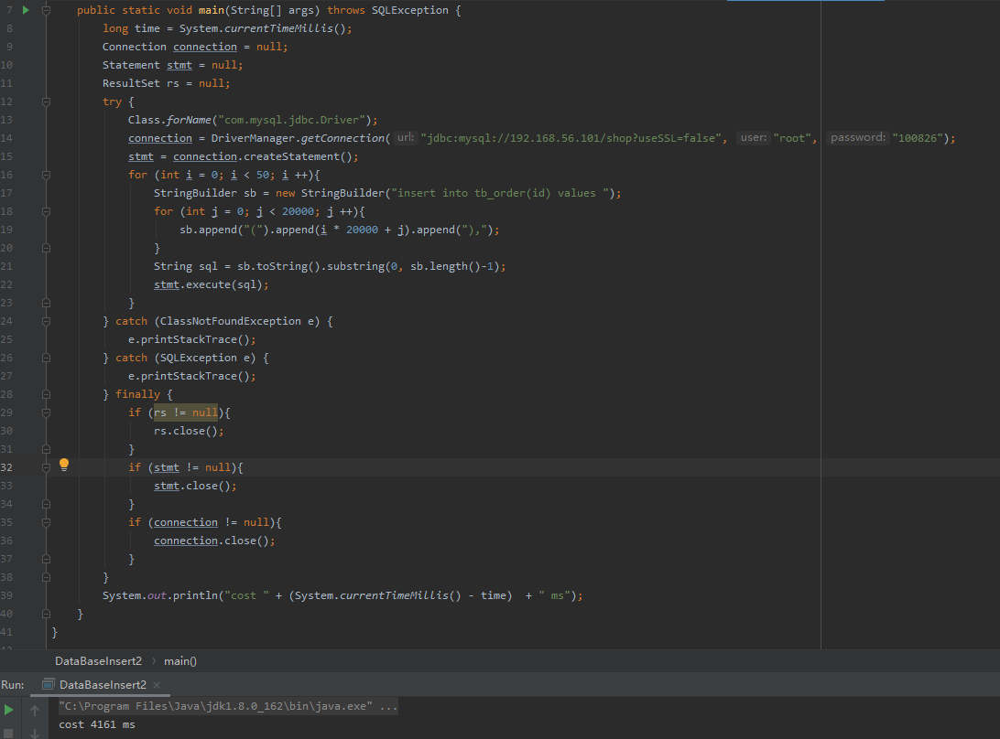
  * 1000000条数据拼接成一条sql,报错，sql太长了
    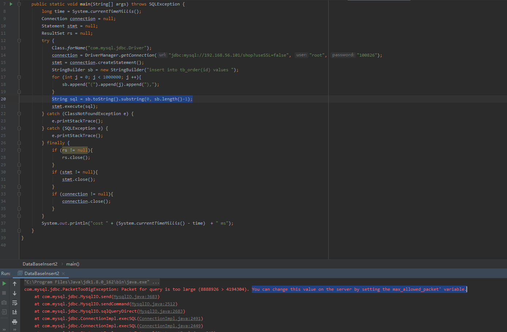
    设置足够的max_allowed_packet大小后，耗时约5s
    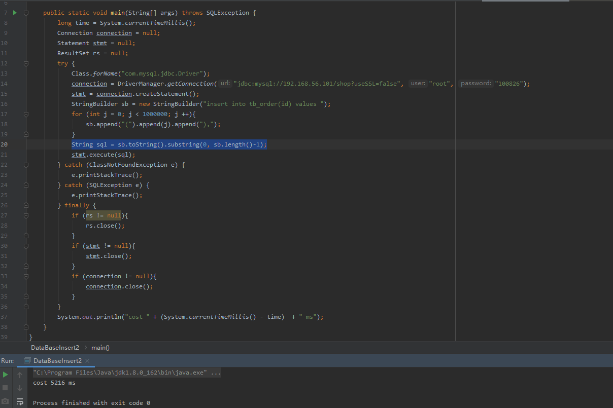
* 第三种方式 批处理executeBatch，
  * 使用Statement 耗时约552s （zhangc.dbinsert100k.DataBaseInsert3）
    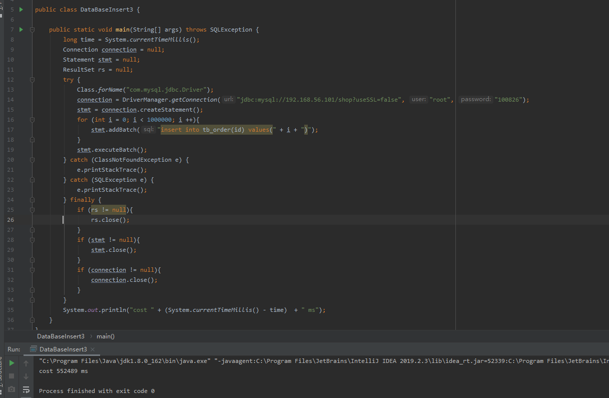
  * 使用PreparedStatement 耗时约535s（zhangc.dbinsert100k.DataBaseInsert4）
    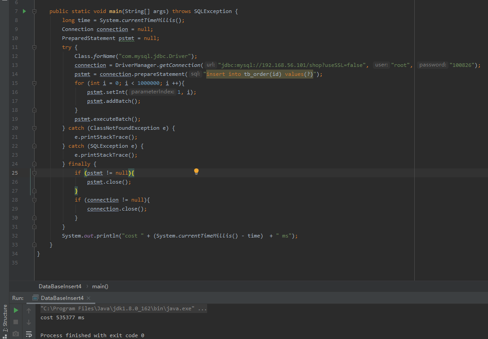
* 第四种方式 2与3结合
  * 批处理，每5000条数据拼成1条sql，使用Statement 耗时约4s（zhangc.dbinsert100k.DataBaseInsert5）
    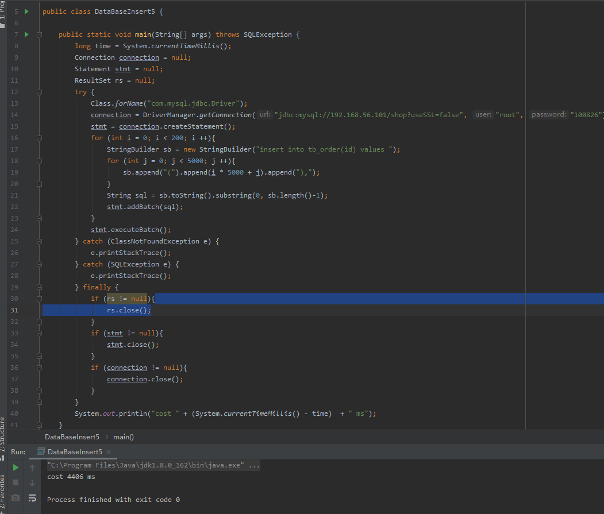
  * 批处理，每1000条数据拼成1条sql，使用PreparedStatement 耗时约4s（zhangc.dbinsert100k.DataBaseInsert6）
    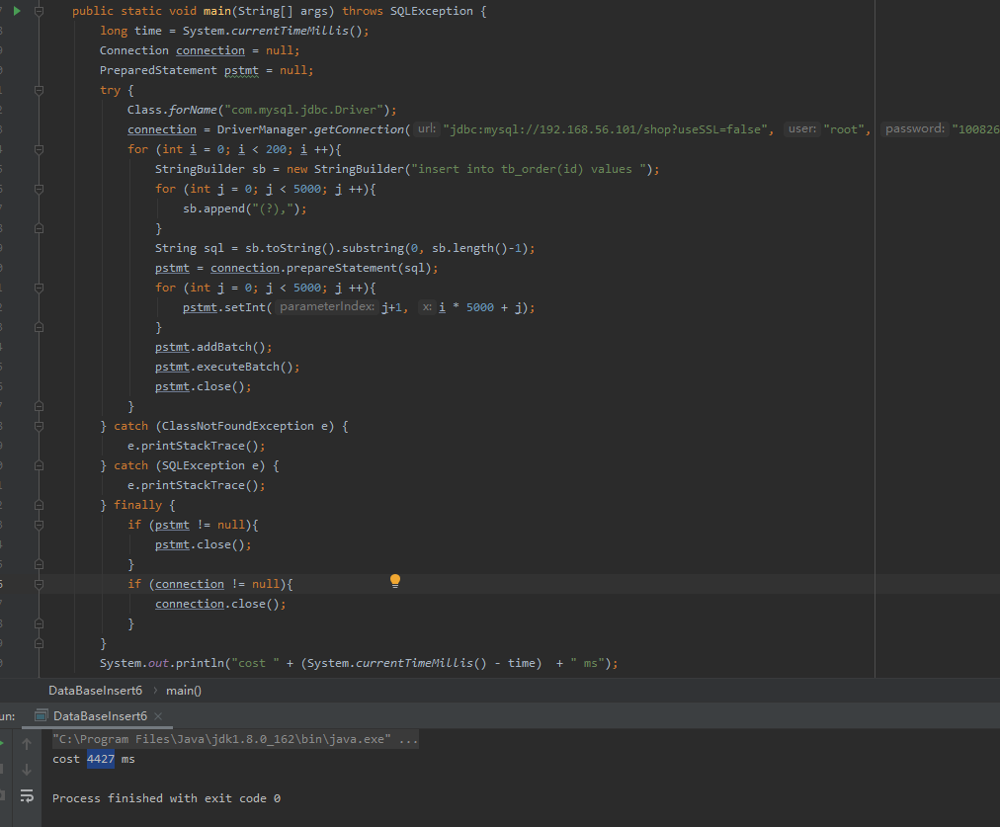

# 周日必做题题2
读写分离 - 动态切换数据源版本 1.0  /weeko7project/rwseparate01项目下

# 周日必做题题3
读写分离 - 数据库框架版本 2.0 /weeko7project/rwseparate02项目下

